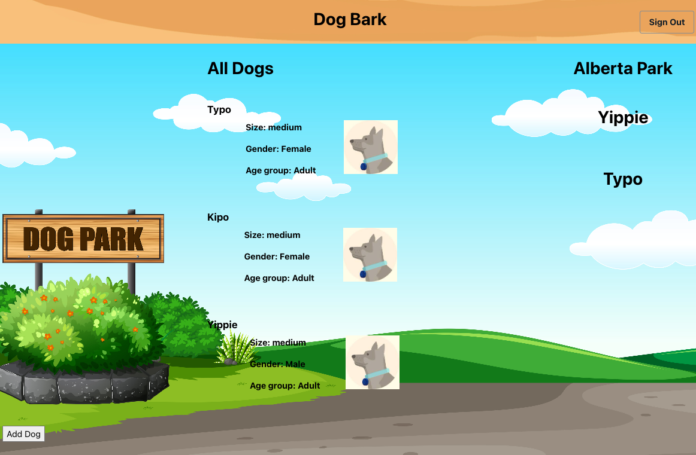
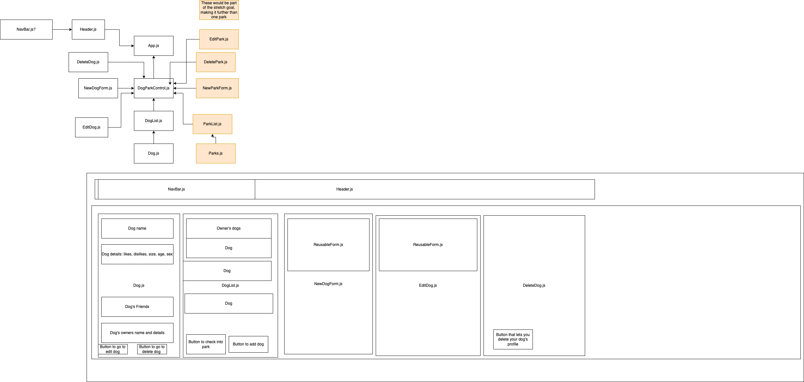

# Dog Bark / Capstone

## By Liam Campbell

## Description

_A React webpage that helps users have a positive dog park experience._ 

### Table of Contents

[Technologies Used](#technologies-used)  
[Description](#description)  
[Setup/Installation Requirements](#setup-and-installation-requirements)
[React planning map](#react-map)
[Reasearch and Planning Log](#research-log) 
[Known Bugs](#known-bugs)  
[License](#License)

## Technologies used
* React
* Javascript
* AWS DynamoDB
* AWS amplify
* AWS graphql
* JSX
* draw.io
## Capstone Proposal 

_This project aims to make it easier to take your dog to the dog park by helping your dog to make friends. Here is the full [capstone proposal](./CapstonePropsal.md)._

### Background image Attribution

<pre>
<a href="https://www.vecteezy.com/free-vector/madeira">Madeira Vectors by Vecteezy</a>
<a href="https://www.vecteezy.com/free-vector/dog-park">Dog Park Vectors by Vecteezy</a>
</pre>

## React Map

_&#8593; I will clean this up before final submission_

## Research log

>### 9/16/22  3hr
>
>> 2p - 2:30
>
>_Read thinking in React._
>
>> 2:30 - 3p
>
>_Research Hooks_
>
>> 3p - 4p
>
>_Research hook side effects_
>
>> 4p - 5p
>
>_Research NoSQL_
>
>### 9/17/22 2hr / 5hr total
>
>> 9a - 10a 
>
>_Continue reasearching NoSQL_
>
>> 10a - 11a
>
>_Read about differences between Firebase and AWS_
>
>### 9/18/22 3hr / 8hr total
>
>> 930a - 10:15a
>
>_Research NoSQL data structure/ differences between SQL and NoSQL._ 
>
>> 10:15a - 10:45a
>
>_Write up capstone proposal, can be found [here](https://docs.google.com/document/d/1yxRCpg8vTEHJAs1Qay7uP65t-RreGbJPicOqEb2ECiM/edit?usp=sharing)_
>
> 10:45 - 11:45
>
>>_Make diagram_
>
>11:45 - 1230
>
>> _Build Dog, DogList, DogParkControl basic structure_
>
>### 9/21/22 8hrs / 16 hrs total
>
>> _Working in app, can create, new dogs with traits, and delete them, can send them to the park._
>
>### 9/24/22 2hrs / 18 hrs total
>
>2p - 4p
>
>> _AWS tutorial, add amplify, display list, use api to call to database, still working on this tutorial, should be able to host images but they are just popping up as broken img files._ 
>
>### 9/27/22 1 hr / 19 hrs total
>
>7p - 8p
>
>>Read about users in Amplify, set up at the park list.
>
>### 9/30/22 3 hrs / 22 hrs total
>
>7:15a - 10:15a 
>
>> _Plan for day, refocus on MVP_
>
> - [x] A user can enter information about their dog, i.e. size, name. likes and dislikes...
>
> - [x] A user can say they are taking their dog to the park
>
> - [x] A user can list other dogs as their dog's friends and see when they are at the park.
>   
>   - [x] Add element to dogs that will take an array of the dog's friend's ids.
>   - [x] Have a spot to display this array.
>
>
>### 10/2/22 2 hrs/ 24 hrs total
>
> 8:15p - 10:15 
>
> - [x] _Impliment AWS, amplify, dynamodb_

## Known Bugs/ WIPs

* Impliment owners for dogs. 
* Add dog park information.

## License

[Copyright](LICENSE) (c) 10/05/2022 Liam Campbell

## Contact Information 

_Feel free to reach out via [github](https://github.com/lcmpbll)_

