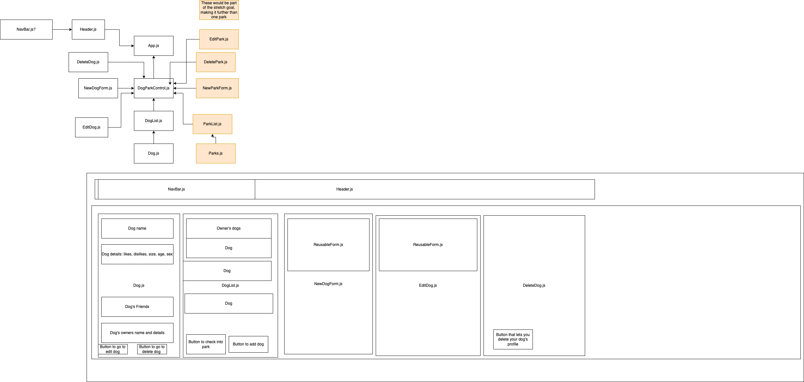

# Capstone

## By Liam Campbell
## Technologies used
* React
* Javascript
* AWS DynamoDB
* draw.io
## Capstone Proposal 

_This project aims to make it easier to take your dog to the dog park by helping your dog to make friends. Here is the full [capstone proposal](https://docs.google.com/document/d/1yxRCpg8vTEHJAs1Qay7uP65t-RreGbJPicOqEb2ECiM/edit?usp=sharing)._

## React Map

_&#8593; I will clean this up before final submission_

>## 9/16/22  3hr
>
>> 2p - 2:30
>
>_Read thinking in React._
>
>> 2:30 - 3p
>
>_Research Hooks_
>
>> 3p - 4p
>
>_Research hook side effects_
>
>> 4p - 5p
>
>_Research NoSQL_
>
>## 9/17/22 2hr / 5hr total
>
>> 9a - 10a 
>
>_Continue reasearching NoSQL_
>
>> 10a - 11a
>
>_Read about differences between Firebase and AWS_
>
>## 9/18/22 3hr / 8hr total
>
>> 930a - 10:15a
>
>_Research NoSQL data structure/ differences between SQL and NoSQL._ 
>
>> 10:15a - 10:45a
>
>_Write up capstone proposal, can be found [here](https://docs.google.com/document/d/1yxRCpg8vTEHJAs1Qay7uP65t-RreGbJPicOqEb2ECiM/edit?usp=sharing)_
>
> 10:45 - 11:45
>
>>_Make diagram_
>
>11:45 - 1230
>
>> _Build Dog, DogList, DogParkControl basic structure_

